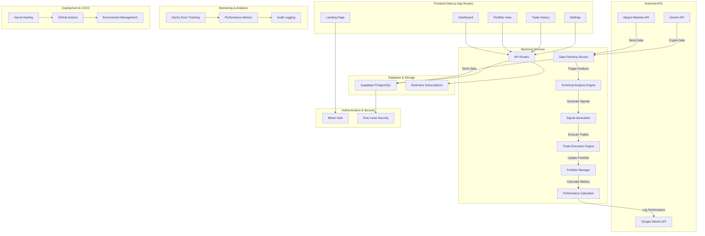
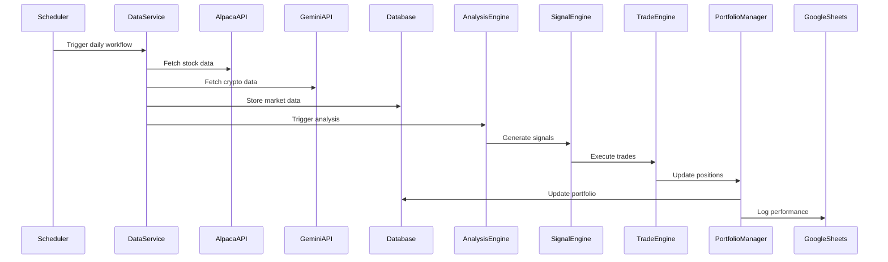
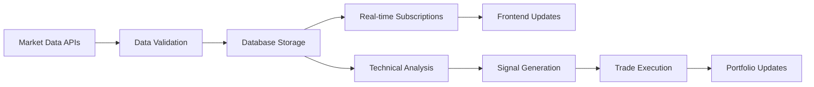
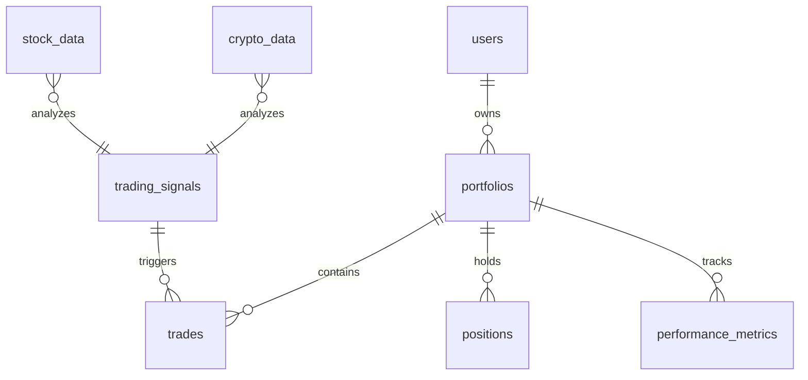
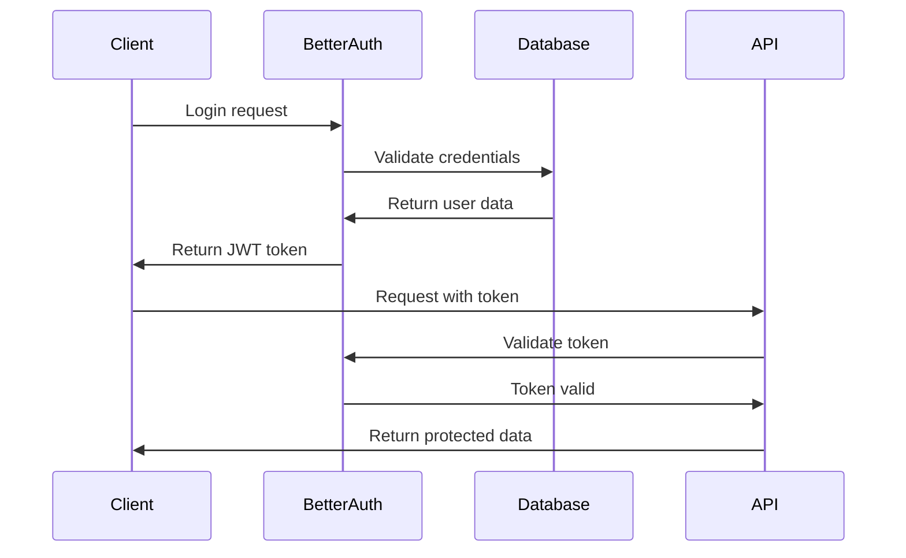
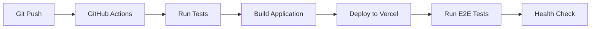

# AI Trader - System Architecture Documentation

## 1. Overview

The AI Trader is a fully automated trading system that integrates real-time market data analysis, multi-strategy technical analysis, and automated trade execution for both stocks and cryptocurrencies.

## 2. High-Level Architecture

## 3. Component Architecture

### 3.1 Frontend Layer
- **Technology**: Next.js 14 (App Router), React 18, Shadcn/UI, Tailwind CSS
- **State Management**: Zustand for client-side state
- **Real-time Updates**: Supabase subscriptions for live data
- **Responsive Design**: Mobile-first approach with Tailwind CSS

### 3.2 Backend Services Layer
- **API Routes**: Next.js API routes for server-side logic
- **Data Services**: Centralized data fetching and management
- **Business Logic**: Trading algorithms and portfolio management
- **Scheduled Tasks**: Cron jobs for automated trading workflow

### 3.3 Data Layer
- **Primary Database**: Supabase PostgreSQL with Row Level Security
- **Real-time Features**: Supabase real-time subscriptions
- **Data Backup**: Automated backup to Google Sheets
- **Caching**: Redis-like caching for frequently accessed data

### 3.4 Security Layer
- **Authentication**: Better Auth with JWT tokens
- **Authorization**: Role-based access control (RBAC)
- **Data Protection**: Encryption at rest and in transit
- **API Security**: Rate limiting and request validation

## 4. Data Flow Architecture

### 4.1 Daily Automated Workflow

### 4.2 Real-time Data Flow

## 5. Database Schema

### 5.1 Core Tables
- **users**: User profiles and authentication data
- **portfolios**: User portfolio information
- **stock_data**: Real-time and historical stock data
- **crypto_data**: Real-time and historical cryptocurrency data
- **trading_signals**: Generated trading signals with reasoning
- **trades**: Executed trades with full audit trail
- **positions**: Current portfolio positions
- **performance_metrics**: Daily performance calculations

### 5.2 Relationships

## 6. API Endpoints

### 6.1 Authentication Endpoints
- `POST /api/auth/sign-in` - User sign in
- `POST /api/auth/sign-up` - User registration
- `POST /api/auth/sign-out` - User sign out
- `GET /api/auth/session` - Get current session

### 6.2 Data Endpoints
- `GET /api/market/stocks` - Get stock data
- `GET /api/market/crypto` - Get cryptocurrency data
- `POST /api/market/sync` - Sync market data
- `GET /api/analysis/signals` - Get trading signals

### 6.3 Trading Endpoints
- `POST /api/trades/execute` - Execute trade
- `GET /api/trades/history` - Get trade history
- `GET /api/portfolio/positions` - Get current positions
- `GET /api/portfolio/performance` - Get performance metrics

### 6.4 Admin Endpoints
- `POST /api/admin/scheduler/trigger` - Manually trigger workflow
- `GET /api/admin/health` - System health check
- `GET /api/admin/logs` - Get system logs

## 7. Security Architecture

### 7.1 Authentication Flow

### 7.2 Data Protection
- **Encryption**: AES-256 encryption for sensitive data
- **API Keys**: Stored in Vercel environment variables
- **Database**: Row Level Security (RLS) policies
- **Transport**: HTTPS/TLS 1.3 for all communications

## 8. Monitoring & Observability

### 8.1 Error Tracking
- **Sentry Integration**: Real-time error monitoring
- **Custom Metrics**: Trading performance metrics
- **Health Checks**: Automated system health monitoring
- **Alerting**: Critical error notifications

### 8.2 Performance Monitoring
- **API Response Times**: Track endpoint performance
- **Database Queries**: Monitor query execution times
- **Trade Execution**: Track trade latency
- **User Experience**: Frontend performance metrics

## 9. Deployment Architecture

### 9.1 Vercel Configuration
- **Runtime**: Node.js 18+ serverless functions
- **Static Assets**: CDN distribution
- **Environment Variables**: Secure configuration management
- **Preview Deployments**: Branch-based deployments

### 9.2 CI/CD Pipeline

## 10. Scalability Considerations

### 10.1 Performance Optimization
- **Database Indexing**: Optimized queries for large datasets
- **Caching Strategy**: Redis for frequently accessed data
- **Connection Pooling**: Efficient database connections
- **CDN**: Static asset optimization

### 10.2 Future Scaling
- **Microservices**: Split services for better scalability
- **Load Balancing**: Distribute traffic across instances
- **Database Sharding**: Horizontal scaling for large datasets
- **Queue System**: Async processing for heavy workloads

## 11. Risk Management

### 11.1 Trading Risks
- **Position Sizing**: Maximum position limits
- **Stop Losses**: Automatic loss protection
- **Diversification**: Cross-asset portfolio balance
- **Circuit Breakers**: Emergency trading halts

### 11.2 Technical Risks
- **API Rate Limits**: Graceful handling of rate limits
- **Data Validation**: Comprehensive input validation
- **Backup Systems**: Multiple data sources
- **Disaster Recovery**: Automated backup and restore

## 12. Compliance & Legal

### 12.1 Data Privacy
- **GDPR Compliance**: User data protection
- **Data Retention**: Automated data lifecycle management
- **User Consent**: Explicit consent for data processing
- **Right to Deletion**: User data deletion capabilities

### 12.2 Financial Regulations
- **Trade Logging**: Complete audit trail
- **Risk Disclosure**: Clear risk warnings
- **Paper Trading**: Safe testing environment
- **Regulatory Reporting**: Compliance with trading regulations